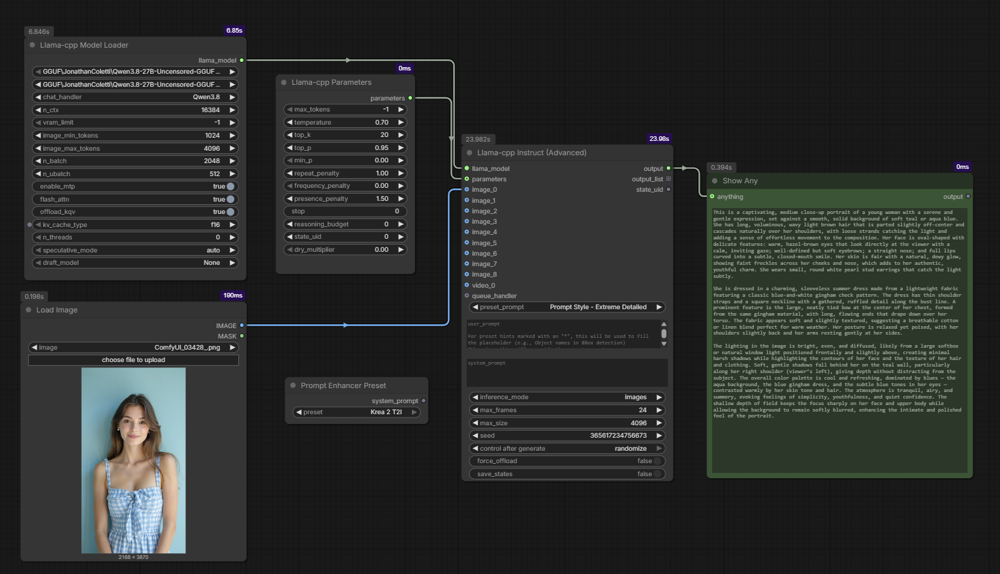

# ComfyUI-llama-cpp_vlm

An advanced, high-performance ComfyUI custom node suite for running Large Language Models (LLMs) and Vision-Language Models (VLMs) natively based on [`llama.cpp`](https://github.com/ggerganov/llama.cpp) and [`llama-cpp-python`](https://github.com/JamePeng/llama-cpp-python).

---

## 🌟 Key Features in This Fork

### 🖼️ Multi-Image & Video Tagging Workflows
* **Dedicated Dynamic Sockets (`image_0`..`image_8`, `video_0`):** Features 9 reference image inputs and a dedicated video input with smooth dynamic canvas expansion.
* **Inline Tagging & Placeholder Interleaving:** Reference specific images directly in your prompt using tags like `<Picture 0>`, `<Picture 1>`, `<image_0>`, `<image_1>`. Visual tokens are placed at exact placeholder positions.
* **Ultra-High Resolution (`max_size = 4096`):** Supports high-resolution image inputs out of the box without downscaling artifacts.

### 🤖 Broad VLM & LLM Model Support
* **Google Gemma 4 (12B & 31B):** Native support for `Gemma4` and `Gemma4-Thinking` with automatic non-causal attention batching (`n_ubatch >= 2048`).
* **Qwen 3.8, Qwen 3.6 & Qwen 3.5 Series:** Full support for `Qwen3.8`, `Qwen3.8-Thinking`, `Qwen3.6`, `Qwen3.6-Thinking`, `Qwen3.5`, `Qwen3.5-Thinking`, `Qwen3-VL`, and `Qwen2.5-VL`.
* **OCR & Specialized Handlers:** Native handlers for `DeepSeek-OCR`, `MinerU2.5-Pro`, `MiniCPM-v4.5 / v4.6`, `PaddleOCR-VL-1.5`, `Qwen3-ASR`, `Step3-VL`, `GLM-4.6V`, `LFM2.5-VL`, `Granite-Docling`, and more.

### ⚡ Speculative Decoding & Performance
* **Draft Models & MTP Sidecars:** Accelerate generation using `speculative_mode` (`draft_dflash`, `draft_dspark`, `ngram_map_k`, `draft_exact`, or `auto`) with dedicated draft model selection (`DFlash`, `DFlash2`, `DSpark`, `MTP`).
* **Smart Multimodal Speculative Guard:** Automatically bypasses speculative draft engines during vision/video requests (protecting against position gaps and negative token crashes) while keeping full speculation speed active for text requests.
* **Flash Attention (`flash_attn`):** Reduces KV cache VRAM consumption by 50–70% on long context windows (16k–128k).
* **Quantized KV Cache (`kv_cache_type`):** Supports `"f16"`, `"q8_0"`, and `"q4_0"` to save up to 75% VRAM on massive context workflows.

### 🎨 Built-in Prompt Enhancer Presets
* **`Krea 2 T2I`:** Expert step-by-step reasoning prompt expander tailored for Krea 2 and next-generation T2I models.
* **`Flux.2 T2I` & `Flux.2 I2I`:** Clean visual prompt engineering and precise editing instructions for FLUX.2.
* **`Z-Image Turbo`:** Structured aesthetic prompt expansion.
* **`Qwen-Image` Suite:** High-quality English prompt expansion and editing presets (`Qwen-Image [EN]`, `Qwen-Image 2512 [EN]`, `Qwen-Image-Edit`).

---

## 📸 Preview



---

## 📦 Installation

### 📋 Requirements
> [!IMPORTANT]
> Requires **`llama-cpp-python` v0.3.49 or newer** to function properly. Pre-built wheels with CUDA 13.0, CUDA 12.8, and Metal acceleration can be found at the [`JamePeng/llama-cpp-python`](https://github.com/JamePeng/llama-cpp-python) repository.

### 1. Clone the repository into ComfyUI custom nodes:
```bash
cd ComfyUI/custom_nodes
git clone https://github.com/sthao42/ComfyUI-llama-cpp_vlm.git
python -m pip install -r ComfyUI-llama-cpp_vlm/requirements.txt
```

### 2. Download Models:
* Place GGUF model files in `ComfyUI/models/LLM`.
* Place matching vision projector (`mmproj`) files in `ComfyUI/models/LLM`.
* Place speculative draft models (e.g. `dflash-*.gguf`, `dspark-*.gguf`) in `ComfyUI/models/LLM`.

---

## 🛠️ Usage & Node Reference

### `llama_cpp_model_loader` (Llama-cpp Model Loader)
* **`n_ctx`**: Total context length limit (default: `16384`, supports up to `327680`).
* **`image_min_tokens` / `image_max_tokens`**: Fine-grained vision token allocation per image patch (default: `1024` / `4096`).
* **`speculative_mode`**: Select speculative mode (`auto`, `draft_dflash`, `draft_dspark`, `ngram_map_k`, `draft_exact`, or `none`).
* **`draft_model`**: Select an optional draft model sidecar (e.g., DFlash/DSpark/MTP) for speculative speedups.
* **`vram_limit`**: VRAM limit in GB (`-1` = no limit).
* **`n_batch` / `n_ubatch`**: Logical prompt batch and physical micro-batch size.
* **`flash_attn`**: Toggle Flash Attention for low VRAM long-context processing.
* **`offload_kqv`**: Offload KV cache tensors directly to GPU VRAM for maximum speed.
* **`kv_cache_type`**: Choose `"f16"`, `"q8_0"`, or `"q4_0"`. Quantizing KV cache saves up to 75% VRAM.
* **`n_threads`**: CPU thread tuning (`0` = auto-detect).
* **`enable_mtp`**: Enable speculative decoding using `SpecConfig`.

### `llama_cpp_instruct_adv` (Llama-cpp Instruct (Advanced))
* **`image_0`..`image_8`**: Connect reference images. Dynamic sockets reveal up to 9 images automatically.
* **`video_0`**: Connect input video batches for temporal understanding.
* **`custom_prompt`**: Input prompt text. Supports `<Picture 0>`, `<image_0>` tags for inline placement.
* **`preset_prompt`**: Built-in prompts for captioning, tagging, or multi-image comparison.
* **`max_size`**: Maximum image resolution dimension (default: `4096`).

### `PromptEnhancerPreset` (Prompt Enhancer Preset)
* Connect to your prompt input to automatically inject curated system prompts (`Krea 2 T2I`, `Flux.2 T2I`, `Flux.2 I2I`, `Z-Image Turbo`, `Qwen-Image`, etc.).

### `llama_cpp_parameters` (Llama-cpp Parameters)
* **`max_tokens`**: Maximum generated tokens (default: `4096`, set `-1` for uncapped generation).
* **`stop`**: Comma-separated list of stop phrases (e.g. `"###, \n\n"`).
* **`reasoning_budget`**: Max token budget for thinking models (`Gemma4-Thinking`, `Qwen3.8-Thinking`, `Qwen3.6-Thinking`).
* **Sampling parameters**: `temperature`, `top_p`, `min_p`, `repeat_penalty`, `frequency_penalty`.

---

## 📜 Credits & Acknowledgments
* [llama-cpp-python](https://github.com/JamePeng/llama-cpp-python) by @JamePeng
* [ComfyUI-llama-cpp](https://github.com/lihaoyun6/ComfyUI-llama-cpp) by @lihaoyun6
* [ComfyUI-llama-cpp](https://github.com/kijai/ComfyUI-llama-cpp) by @kijai
* [ComfyUI](https://github.com/comfyanonymous/ComfyUI) by @comfyanonymous
